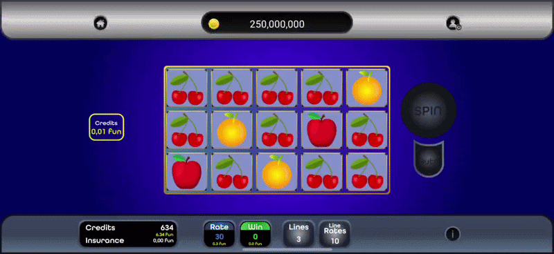
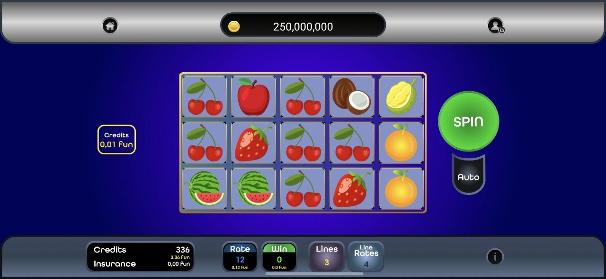
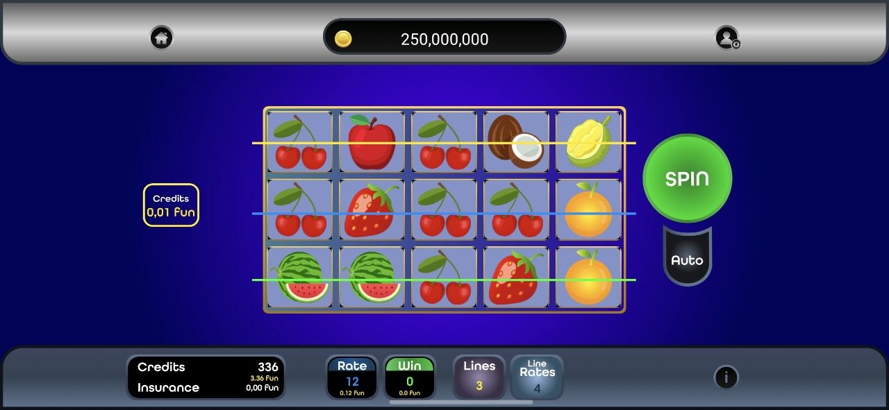
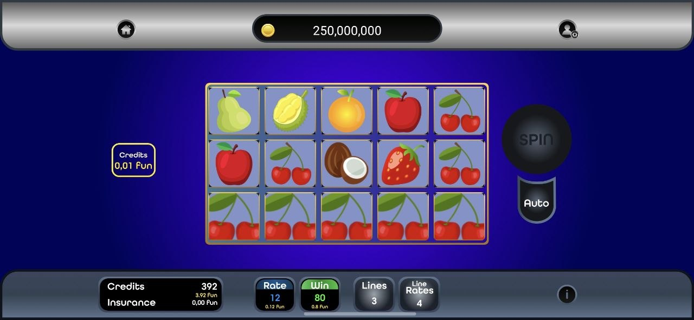
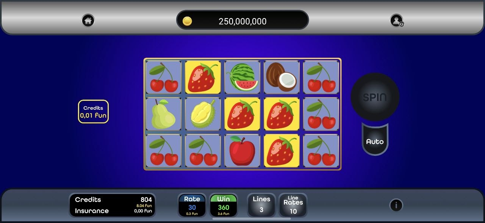
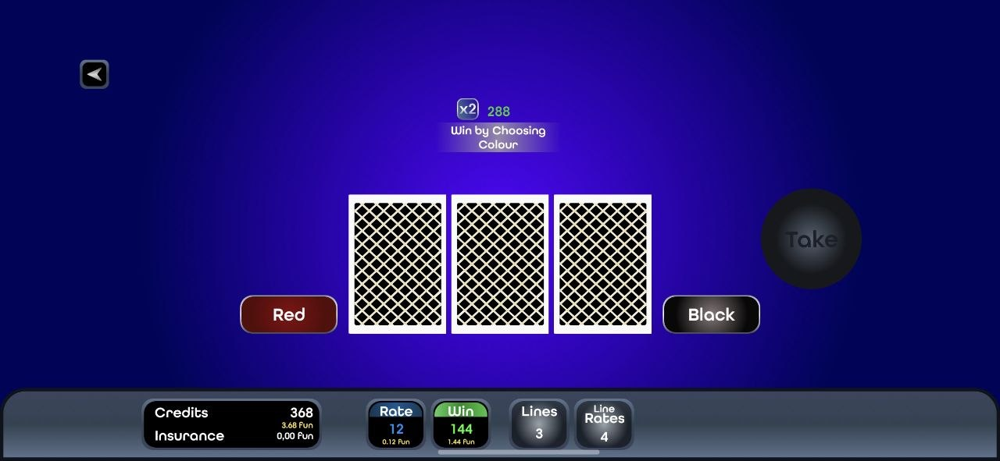
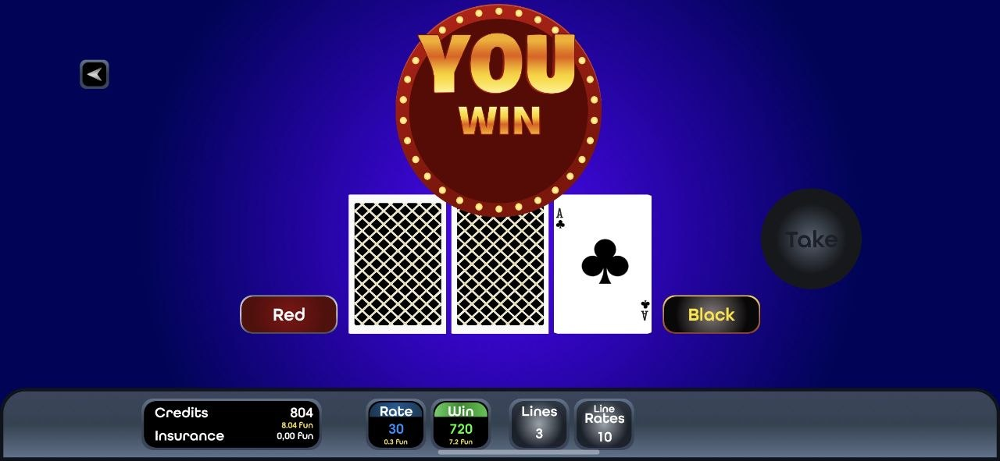
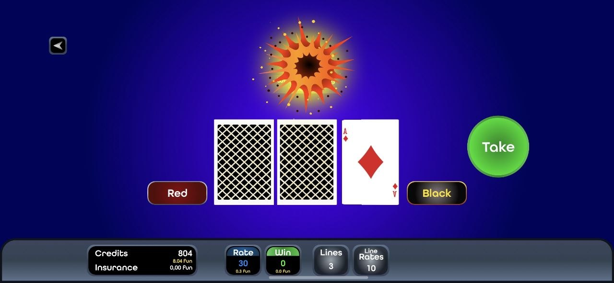

# Fruit Party

Fruit Party is an Android slot-style game written in Kotlin. I built it in my first year as an Android developer as a learning project: I wanted to recreate the fruit-machine feel from arcade games I played as a kid, while practicing non-trivial UI animation, game-state flows, and persistence.

The player spins five vertical reels, enables one to three paylines, adjusts the stake, and collects wins for three-, four-, or five-of-a-kind combinations. A coconut acts as a wild, a premium **Fruit Party** symbol pays higher, and strawberries can trigger a card bonus where red/black guesses multiply the prize—or end the round.

**Orientation:** slot play and the bonus mini-game run in **`MainActivity` locked to landscape** (cabinet-style layout). Splash and the game-selection screen are portrait.

## Highlights

- Five reel columns driven by `RecyclerView`, with spin animations that **stop the reels one after another** (staggered braking) so the spin reads closer to a physical cabinet than every column snapping at once; stopped tiles are read back into active paylines for evaluation
- **Weighted reel decks**: each symbol is defined with an integer **`weight`** and line multipliers **`x3` / `x4` / `x5`** (`Element`). The repository builds each reel’s pool by **`repeat(element.weight)`**—every icon is copied that many times into a list, then the lists are **shuffled** and bound to the adapters; middle reels use the full pool, outer reels use the same idea **without strawberries**. Payouts and rarity are tuned together in data (e.g. **Fruit Party** has weight `1` and the largest multipliers), not computed automatically from the paytable
- Payline UI that switches which horizontal lines are active and wires those choices into win calculation
- Win presentation that animates successful lines after the reels settle (including wild handling via coconut)
- Strawberry-triggered “super game” flow with its own animation beat before the card bonus
- Tunable game feel by changing each symbol’s **`weight`** without rewriting win logic
- Auto-spin, local credits/profile, and game state persisted with Room
- Optional Firebase/Firestore-driven remote configuration and Retrofit-backed blog/privacy screens

## Demo

Landscape recording — wider preview:

<p align="center">
  
</p>

The clip shows typical gameplay in landscape (spin/stop cadence, wins, and bonus flow).

## Screenshots

All gameplay captures below are **horizontal (landscape)** to match the slot UI.

<p align="center">
  
  
</p>

<p align="center">
  
  
</p>

<p align="center">
  
  
</p>

<p align="center">
  
</p>

## Architecture

MVVM-style layout with repositories coordinating Room, Firebase loading, slot outcome calculation, and bonus state. UI layer uses ViewModels, LiveData/flows, Navigation Component, and Koin for DI.

```text
app/src/main/java/com/example/fruitparty
├── data
│   ├── database        # Room entities, DAOs, converters
│   ├── model           # User, symbols, cards, blog/Firestore models
│   ├── repository      # Local/remote coordination and game logic glue
│   └── services        # Network helpers, constants, loading/game states
├── di                  # Koin modules
└── ui                  # Activities, fragments, adapters, ViewModels
```

## Tech Stack

- Kotlin, MVVM, ViewBinding, Navigation Component  
- Coroutines, LiveData, SharedFlow  
- Room, Retrofit + Gson, Koin  
- Firebase (Analytics, Auth, Firestore, Messaging, Remote Config flow)  
- RecyclerView + DiffUtil, Glide  

## Requirements

- Android Studio  
- JDK 17  
- Android SDK 35  
- Minimum SDK 21  

## Running the Project

1. Clone the repository.  
2. Open it in Android Studio and sync Gradle.  
3. Run the `app` configuration on an emulator or device:

   ```bash
   ./gradlew assembleDebug
   ```

## Project Status

Early-career portfolio piece. It reflects solid experimentation with animation-heavy gameplay and stateful UI on Android. Given more time today I would extract pure slot/bonus engines for testing, trim repository responsibilities, expand unit coverage around payouts and weighting, and harden the Firebase/bootstrap path for offline-first play.

## Author

Sergey Kosarevskiy — Android / React Native developer  
